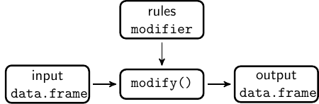

<!--
%\VignetteEngine{simplermarkdown::mdweave_to_html}
%\VignetteIndexEntry{Introduction to dcmodify}
-->

---
title: Introduction to `dcmodify`
author: Mark P.J. van der Loo and Edwin de Jonge
css: "style.css"
---

_Rule-based data processing for data cleaning._

Package version `packageVersion("dcmodify")`{.R}.

Please use `citation("dcmodify")` to cite the package.

## Introduction

The `dcmodify` package allows users to declare (conditional) data
processing steps without hard-coding them in an R script.



The motivating use case is where domain experts need to frequently update (fix)
values of a data set depending on data conditions. Such updates require (1)
selecting the cases where the conditions apply, and (2) updating the values.


### Example

We create a dataset where we asked some imaginary respondents about their
average water consumption per day.

```{.R}
water <- data.frame(
   name        = c("Ross", "Robert", "Martin", "Brian", "Simon")
 , consumption = c(110, 105, 0.15, 95, -100) 
)
water
```

Here, Martin submitted his water consumption in m^3^ while the others
responded in liters. Such a unit of measure error can be
detected  and fixed. Simon took the engineering approach, interpreted
consumption as a _sink_, and put a negative sign in front of his
answer. Again, this is a data error that can be detected and fixed
easily.

If such errors occur frequently, it makes sense to store the treatment.  In
`dcmodify` this can be solved as follows.

```{.R}
library(dcmodify)
# define a rule set (here with one rule)
rules <- modifier(
          if ( abs(consumption) <= 1 ) consumption <- 1000*consumption  
        , if ( consumption < 0 ) consumption <- -1 * consumption )  

# apply the ruleset to the data
out <- modify(water, rules)
out
```
In the first step we define a set of conditional data modifying
rules of the form:
```
if (some condition) change somthing
```
next, using `modifier()`, these rules are applied record-wise.

## What's the idea 

In `dcmodify` conditional data modifying rules are first class citizens.
Modifying rules can be created, deleted, read from or written to file,
filtered, selected, and investigated. And of course, applied to data.

In particular, the `rules` object of the previous example is basically a list
of class `modifier`.
```{.R}
rules
```

For example, we may select one rule and apply it to our original data
set.
```{.R}
modify(water, rules[2])
```

We can ask which variables are used in the modifying rules (here: only one).
```{.R}
variables(rules)
```

### Exercises

1. Load the `retailers` dataset from the validate package
   using `data("retailers", package="validate")`.
2. Create a modifier that (1) sets `other.rev` to zero
   if it is missing, (2) replaces negative `other.rev` with
   the absolute value.


## Import/export of rules and rule metadata

The `dcmodify` package supports reading/writing rules from free text file,
`yaml` files, or data frames. For example, consider the contents of the file
`myrules.txt` (to try the following code, create such a file yourself).

```
# myrules.txt

# unit of measure error
if (abs(consumption) <= 1){
  consumption <- 1000*consumption
}

# sign error
if (consumption < 0 ){
  consumption <- -1 * consumption
}
```
Reading the rules is done with the `.file` argument.

```{.R}
rules <- modifier(.file="myrules.txt")
rules
```

A second way to store rules is in [yaml](https://yaml.org/) format. This allows
one to add metadata to rules, including a name, label or description. To demonstrate
this, we will write the rules to `yaml` file and print the file contents.
```{.R}
fn <- tempfile()
# export rules to yaml format
export_yaml(rules,file=fn)

# print file contents
readLines(fn) |> paste(collapse="\n") |> cat()
```

Finally, it is possible to read rules from (and export to) data frame.
A rule data frame must at least contain a `character` column named `rule`;
all other columns are considered metadata.
```{.R}
d <- data.frame(
    name = c("U1","S1")
  , label = c("Unit error", "sign error")
)
d$rule <- c(
   "if(abs(consumption)<=1) consuption <- 1000 * consumption"
  ,"if(consumption < 0) consumption <- -1 * consumption"
)
d
```
Reading from data frame is done with the `.data` argument.
```{.R}
myrules <- modifier(.data=d)
myrules
```

### Exercise

Using the `retailers` dataset of the previous exercises, define
a file with rules that

- fill missing `other.rev` with zero (0)
- detect large staff cost per staff ratios and reduces the staff costs accordingly
  (unit of measure is 1000s of EUR, while some records are expressed in EUR).
- Similar for total revenue and turnover.

See `?retailers` for the meaning of the variables.


## Supported rules

The package supports rules of the form

```
if (some condition holds){
  change some existing values
} 
```
where the `else` clause is optional, and the rules are executed
record-by-record. There may be multiple expressions in each `{}`
block, and it is also allowed to have nested `if-else` statements.


## Tracking changes

`dcmodify` allows rule-by-rule change tracking via integration
with the [lumberjack](https://cran.r-project.org/package=lumberjack) package[1].
There are many ways of following what happens to a data file, and we refere
to [1] for an overview of the possibilities of the `lumberjack` package.
Here we demonstrate how to use the cellwise logger, which logs all
changes cell-by-cell.

```{.R}
library(lumberjack)
# create a logger (see ?cellwise)
lgr <- cellwise$new(key="name")
# create rules

rules <- modifier(
          if ( abs(consumption) <= 1 ) consumption <- 1000*consumption  
        , if ( consumption < 0 ) consumption <- -1 * consumption )  

# apply rules, and pass logger object to modify()
out <- modify(water, rules, logger=lgr)

# check what happened, by dumping the log and reading in 
# the csv.
logfile <- tempfile()
lgr$dump(file=logfile)
read.csv(logfile)
```


## References

[1] van der Loo MPJ (2021). Monitoring Data in R with the lumberjack
  Package. _Journal of Statistical Software_, **98**(1), 1--13.
  [doi:10.18637/jss.v098.i01](https://doi.org/10.18637/jss.v098.i01).


